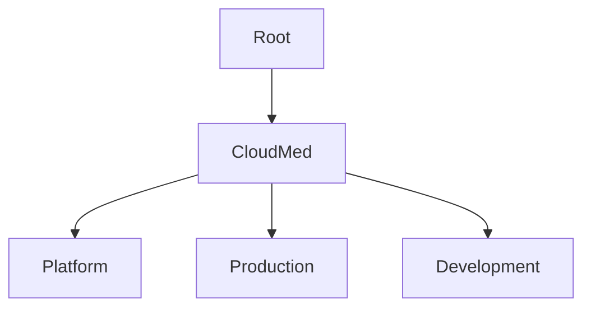
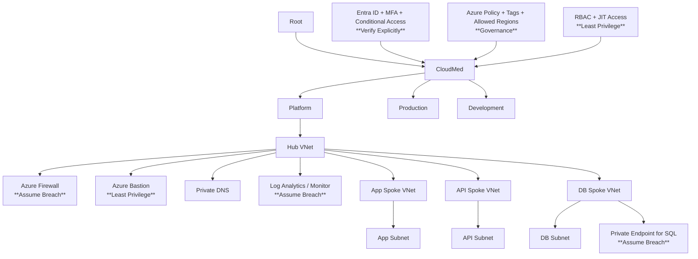

# CST8913_010-Cloud-Migration - Lab10

# Lab 10 – Zero Trust Landing Zone for CloudMed Solutions

## 1. Company Overview

The purpose of this report is to design and document a Zero Trust Azure Landing Pad for the finctional medical company CloudMed Solutions Inc. CloudMed Solutions Inc operates in Canada, the United States, and Europe, providing cloud based medical services through it's main product MedConnect. These services include telehealth sessions between medical professionals and patients, management of electrionic medical records, and AI based health analytics. Due to the sensitive nature of medical data, certain goverment policies must be adhered to for each region CloudMed Solutions Inc operaties in.
- **PIPEDA**: Personal Information Protection and Electronic Documents Act (Canada). Governs orginization's collection, use and disclosure of personal information.
- **HIPPA**: Health Insurance Portability and Accountability Act (US). Law that states how to protect medical information from unauthorized disclosure.
- **GDPR**: General Data Protection Regulation (EU). Law outlining data protection and privacy.
These laws require strict data access and security; therefor, CloudMed Solutions Inc requires an Azure Landing Zone that implements the Zero Trust Principles to comply with the regional laws in order to protect sensitive patient data.

## 2. Governance and Identity

The diagram above describes the management group hierachy for the system, breaking down access into disctinct management groups.
- **Root**: The top level of the management group hierachy
- **Cloud Med**: contains all cloud resources for the company, allowing for centralized governance of the managements groups
- **Platform**: contains shared services such as networking, security, and monitoring used by the system
- **Production**: contains the live applications and services
- **Development**: used for testing and developing without interefing with production environments

Role-Based Access Control (RBAC) is utilized to only allow just enough access for individuals depending on their role. This enforces the Zero Trust principle of least-priveledge access, whereby users are limited to just enough access to preform their duties, depending on their roles. Several roles were considered:
- **Admin**: allowed to manage infrastructure and security settings.
- **DevOps**: allowed to deploy and manage applications and services.
- **Finance**: allowed to view billing and cost management data.

Azure Policies are used to define the standards for the orginization and maintain compliance with the required legislation.
- **Tagging**: resources require the proper tags so that their cost can be tracked and analyzed
- **Allowed Regions**: deployments to regions where compliance is not met are restricted. Ensures regional laws are followed, for example, ensuring data is encyrpted before deployment.
- **Resource Consistency**: ensures resources are created and configured in a standardized way, allowing for predictability and compliance.

Microsoft Entra ID is a cloud-based indentity and access management service that will provide the authentication and authorization to the Azure services. It provides several security benefits and helps to enable the Zero Trust policy of verying explicitly any authentication and authorization. An example would be requiring Multi-Factor Authentication (MFA), a two-step process for authentication, such as confirming identity through SMS. Conditional Access Policies are allowed used, which can limit access based on policy checks. For example, a condition to check whether the user is logging in from an approved location.

## 3. Network Architecture

A hub-and-spoke network achitecture is employed to provide a centralized system to manage security and networking (hub), while isolating the services (spokes) from each other, such as the App, Data, and Api tiers. In this archetecture, all trafic flows through the hub, allowing for shared and centralized security. This approach helps to enforce the Zero Trust policy of Assuming there is a Breach by limited inter-communication between resources. The hub is comprised of several components:
- **Azure Firewall**: controls and enforces security rules on all traffic between networks
- **Azure Bastion**: allows secured access to VM's without exposing them to the public 
- **DNS**: allows for encrypted DNS queries to maintain private communication
- **Log Analytics**: monitors and collects data on services to ensure security and policy compliance

The App, Api, and Data spokes are contained in their own seperate virtual network. Any communication between these tiers is done via the Hub, and only when approved. This ensures services are isolated from the public and inter-service communication is restricted.
- **East-West Traffic Control**: Manages and secures communication between internal services (spokes), with traffic going through the Azure Firewall to monitor and ensure security compliance.
- **Private Endpoints**: Resources are accessed through private IP addresses, avoiding exposure to the public. All communication remains without the Azure networks.
- **Subnet Seperation**: Subnet separation divides each spoke network into smaller sections, such as web, application, and database subnets. This improves security by controlling which systems can communicate with each other.

## 4. Zero Trust Controls

- **Verify Explicitly**: Microsoft Entra provides authentication and authorization, confirming the identity of users before allowing resource access. Furthur supported by MFA, and the conditional policies to limit access based on conditions.
- **Least Privilege Access**: Using RBAC, users are given roles, granting access to the bare mininmum resources required to preform their duties. Using Just-In-Time Access allows for temporary administartive permissions, providing them only when required and automically revoking them upon afterwards. 
- **Assume Breach**: A hub-and-spoke architecture is used to segment and isolate services, preventing communication in the event of a breach. Security logs are generated and collected using Azure Monitor and Log Analytics to notify admins of potential breaches.
## 5. Monitoring, Compliance, and Cost

- **Monitoring**: Azure Monitoring and Log Analytics can be used to monitor and generate logs on Azure services performance and health. Microsoft Defender for Cloud provides security monitoring and threat detection for Azure cloud services. Alerts can be sent to admins to notify them of potential threats.
- **Compliance**: Azure Policy is used to enforce compliance with the standards set by the orginization. These include the assurance of data encryption and deployment only to authorized regions. These are required to adhere to the regional data protection laws. Reports and audits should be preformed regularly to ensure compliance is being met.
- **Cost**: Budgets can be set in Azure to alert the responsible individuals of any overages, or if costs have reached a predefined threshold. Costs accross various departments and resources can be tracked by assigning tags to resources, afterwhich cost breakdowns dependning on tags can be generated.
  
## 6. Conceptual Diagram

## 7. Summary and Recommendations

This design outlines a Zero Trust Azure landing zone for CloudMed Solutions that focuses on protecting sensitive medical data while meeting regional compliance requirements. The use of management groups, RBAC, and Azure Policy helps maintain control over resources and ensure consistent configurations across environments. The hub-and-spoke network architecture improves security by isolating services and controlling communication between them. Monitoring tools and logging also help detect issues early and support ongoing compliance. Overall, the design provides a secure and scalable foundation for CloudMed’s cloud services.

Two recommendations for future improvements:
- **Cost Optimization**: By investigating and auditing costs using Azure Cost Management tools, optimizations can be made to prevent the over-provisioning of resources. One approach would be the automatic scaling of resources based on demand to avoid incurring unnecessary costs.
- **Automation**: A future improvement could include increasing automation in the environment to reduce manual configuration and improve consistency. Automated deployment and management of resources can help prevent errors, improve reliability, and make the system easier to maintain as it grows.
